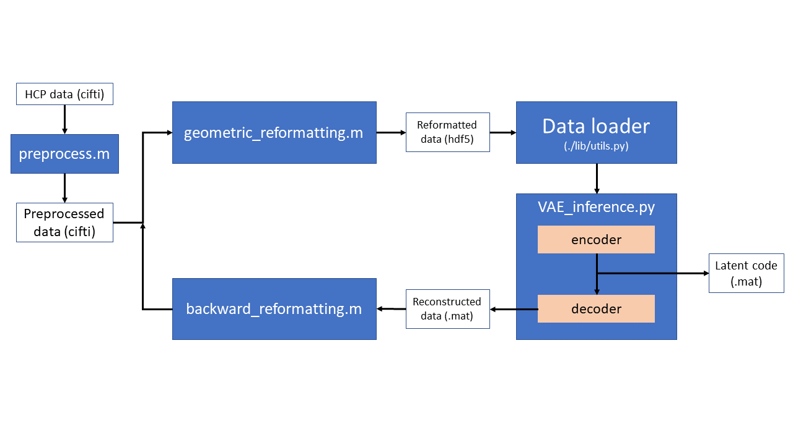

# rsfMRI-VAE
This repository is the official Pytorch implementation of '[Representation Learning of Resting State fMRI with Variational Autoencoder](https://doi.org/10.1016/j.neuroimage.2021.118423)'

## Environments

This code is developed and tested with 

```
Python 2.7.17
Pytorch 1.2.0
```

## Training

To train the model in this paper, run this command:

```train
python fMRIVAE_Train.py --data-path path-to-your-data
```

## Evaluation

If you want to get latent variables of the trained model, change path inside the code `Example_Encoder.py` and run:

```eval1
python Example_Encoder.py
```

If you want to reconstruct images from the latent variables, change path inside the code `Example_Decoder.py` and run:

```eval2
python Example_Decoder.py
```


## Demo
Directory `demo` includes a whole pipeline from processing fMRI data to getting latent variables from VAE. A brief illustration of the pipeline is shown in the figure below. 

<p align="center">
    
</p>
<p align=center>
Illustration of the whole pipeline of demo. 
</p>

The file in the data folder is a cifti file that can be inputted into the `preprocess.m` function, which outputs a cifti file with preprocessed data.  Either the original or preprocessed file can be inputted into the `geometric_reformatting.m` file which outputs a mat file called fMRI.mat and an h5 file called `demo_data.h5` into the data folder.  

The data loader in `/demo/lib/utils.py` feeds the reformatted 
data into the VAE when `VAE_inference.py` is run.  This function uses the pretrained model to generate latent variables which are saved in `/demo/result/demolatent` as mat files.  

`VAE_inference.py` also uses the latent variables to generate reconstructed images in `/demo/result/recon` as mat files.  Then `backward_reformatting.m` converts the data back into a cifti file called: `/demo/data/rfMRI_REST1_LR_Atlas_MSMAll_hp2000_clean_reconstruction.dtseries.nii`.

### Usage

Steps for running the VAE data preparation code:

0. Clone github repository into your local computer. 
    - `git clone https://github.com/libilab/rsfMRI-VAE.git`
1. Sample inputs data and trained model weights must be downloaded from [here](https://drive.google.com/drive/folders/1EZug6qm27pk-pfVwx4knqC4oERLI6LZ6?usp=sharing). Place downloaded files into the same directory in `demo`.

    - Download `/checkpoint/checkpoint.pth.tar` into `/demo/checkpoint/`.
    - Download `/data/rfMRI_REST1_LR_Atlas_MSMAll_hp2000_clean.dtseries.nii` into `/demo/data/`.

2. run `preprocess.m`

3. run `geometric_reformatting.m`
4. run `VAE_inference.py`
5. run `backward_reformatting.m`

### Output Layouts
The following intermediate `mat` files will be saved while running the demo codes:

- `demo/data/fMRI.mat`
    - matrix that holds normalized fMRI data for each time point 
    - size: `(num voxels in visual cortex) x (number time points)`
    - This file includes only voxels in valid regions (gets rid of any nan values).

- `/result/MSE_Mask.mat` 
    - This file includes two fields: `Regular_Grid_Right_Mask` and `Regular_Grid_Left_Mask`. 
    - Those two fields hold `im_size x im_size` 2D masks telling whether that voxel is valid, or has an `nan` value (meaning that the data points must be excluded).

- `/result/Left_fMRI2Grid_192_by_192_NN.mat`
    - This file includes two fields: `grid_mapping_L`, `inverse_transformation_L`
- `/result/Right_fMRI2Grid_192_by_192_NN.mat`
    - This file includes two fields: `grid_mapping_R`, `inverse_transformation_R`
    - The grid mapping (for each of L/R) is size `(im_size x im_size) x num_voxels` (without `nan`) and will be multiplied by the voxel data for each time point to map them to the 2D grid the inverse transformation (for each of L/R) maps the data in the 2D grid back to the  voxel space


## License

Copyright 2021 Jung-Hoon Kim and Zhongming Liu
junghoon.kimok@gmail.com or zmliu@umich.edu

Permission is hereby granted, free of charge, to any person obtaining a copy of this software and associated documentation files (the "Software"), to deal in the Software without restriction, including without limitation the rights to use, copy, modify, merge, publish, distribute, sublicense, and/or sell copies of the Software, and to permit persons to whom the Software is furnished to do so, subject to the following conditions:

The above copyright notice and this permission notice shall be included in all copies or substantial portions of the Software.

THE SOFTWARE IS PROVIDED "AS IS", WITHOUT WARRANTY OF ANY KIND, EXPRESS OR IMPLIED, INCLUDING BUT NOT LIMITED TO THE WARRANTIES OF MERCHANTABILITY, FITNESS FOR A PARTICULAR PURPOSE AND NONINFRINGEMENT. IN NO EVENT SHALL THE AUTHORS OR COPYRIGHT HOLDERS BE LIABLE FOR ANY CLAIM, DAMAGES OR OTHER LIABILITY, WHETHER IN AN ACTION OF CONTRACT, TORT OR OTHERWISE, ARISING FROM, OUT OF OR IN CONNECTION WITH THE SOFTWARE OR THE USE OR OTHER DEALINGS IN THE SOFTWARE.


## Reference

Kim, Jung-Hoon, et al. "Representation Learning of Resting State fMRI with Variational Autoencoder." NeuroImage (2021).
https://doi.org/10.1016/j.neuroimage.2021.118423
